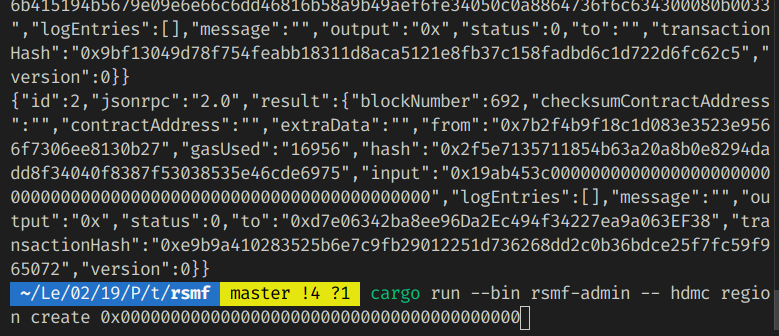
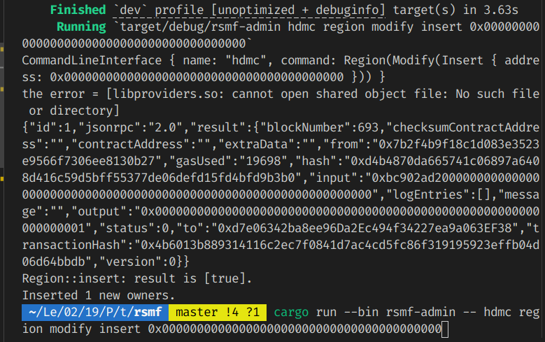
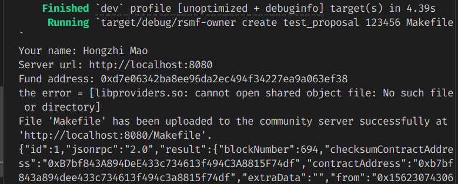
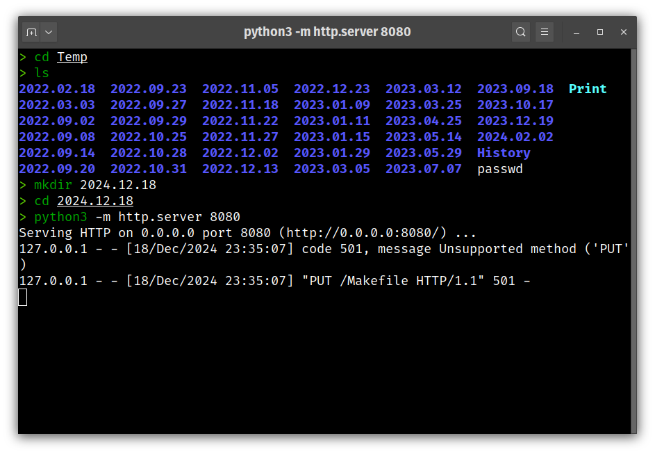
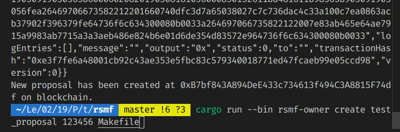

# RSMF - Residential Special Maintainence Fund Management
# 小区专项维修基金管理

[代码仓库](https://github.com/caterpillar-1/RSMF)

## 简介

小区物业管理的一大难题是专项维修基金的使用。在作者 2024 年暑假的毛概实践中，跟踪调查了所在小区物业擅自挪用专项维修基金一事。

- 业主方面
    - 认为维修基金的使用记录不公开透明，查找维修记录需要到房管局
    - 认为物业征集意见时公示不到位，上门时存在一些诱导签字的行为
- 物业方面
    - 上门征集意见和签字持续进行了两年，效率低下，因为业主常不在家

对于公示信息和无信任共识机制，可以使用区块链技术来解决。

## 建模

### 主体

- 人员：业主, 业委会, 物业, 房管局;
- 设备
    - 区块链结点: 业委会集群, 物业集群, 房管局集群, (可选)业主自建结点;
    - 文件服务器: 业委会搭建
- 数据
    - 小区业主在链上的地址
- 合约
    
    

### 流程

- 业主或物业创建维修基金使用的提案
    - 提案是一个文件，上传到业委会
    - 该文件的数字签名保存到区块链智能合约中
    - 创建提案时需要指定金额，后续链上转账操作将依据这个数值
- 业主大会投票
    - 根据《物业管理条例》，2/3 业主通过即通过，进入房管局审批阶段
- 房管局审批并付款
    - 假设收付款时使用以太币
- 物业提款
    - 这里简化了流程，真实流程中，应该有招标流程，而且是由房管局直接付给承包方

业主大会、房管局、物业三权分立、相互制衡，都有“一票否决权”。

任何一方都能即时从区块链获取提案信息。只有业主才能投票。


## 技术栈

- 主要开发语言: Rust (自建简易 SDK, CLI), Solidity
- 区块链: FISCO BCOS
- 前端: CLI, Web (React + Next.js)?

## 网络安全

### CLI 访问业委会文件服务器

业委会分发 Token，使用 HTTP 的 Bearer Auth 方案；

### 生成提案文件的签名

哈希函数: SHA256; 签名算法: ED25519;

## 主要工作 & 学习内容

这个项目包含 Rust 专题练习。由于区块链上不适于进行人民币转账操作，本项目只实现了一个简易原型。

目前实现了房管局 (`rsmf-admin`)、物业 (`rsmf-pm`) 和业主 (`rsmf-owner`) 使用的 CLI，这些 CLI 工具直接使用 SDK 和区块链结点通信。

考虑到实际情形中的易用性，准备开发业委会服务器托管的业主用网页前端。

1. Solidity 合约开发

1. Rust FFI

    通过 Rust FFI 对 BCOS C SDK 接口进行简单封装；（虽然已有社区 Rust SDK，但是没有使用）

1. Rust CLI

    命令行相关库的使用，如 `clap`, `confy`, `reqwest`, `serde`;

## 完成度

- **由于时间和人手原因，只完成了合约开发和命令行客户端，没有完成 Web 前后端**

- **由于自制 Rust SDK 还没有实现事件订阅相关功能，整个设计的流程中涉及事件订阅的相关内容均未完成，演示时通过手动输入合约地址实现**

- **项目仍然处于测试阶段**

## 运行示例

### Solidity 合约在以太坊虚拟机上的测试运行

由于自制 Rust SDK 和客户端完成度较低，先在 EVM 上测试，完成了智能合约的设计要求；

### 环境配置

1. 运行 `/csdk` 中的 `download.sh` 下载 bcos-c-sdk；
2. 使用 FISCO BCOS Java SDK 的教程中的方法，先运行 Java SDK，创建配置文件，并放入 `/conf`，结构如下

    ```sh
    $ tree conf
    conf
    ├── accounts
    │   ├── 0xa886fcea71c86163bf835564988022af55a12e68.pem
    │   ├── 0xa886fcea71c86163bf835564988022af55a12e68.pem.pub
    │   └── 0xa886fcea71c86163bf835564988022af55a12e68.public.pem
    ├── ca.crt
    ├── ca.key
    ├── ca.srl
    ├── cert.cnf
    ├── config.ini
    ├── sdk.crt
    ├── sdk.key
    └── sdk.nodeid
    ```
3. `make build` 使用 `solc` 编译合约；

### `rsmf-admin`: 房管局命令行客户端

- 创建小区

    ```sh
    # 创建名为 hdmc 的小区，其物业的地址为 0x00...
    $ cargo run --bin rsmf-admin -- hdmc region create 0x0000000000000000000000000000000000000000 
    ```
    

- 添加业主

    ```sh
    # 向名为 hdmc 的小区添加业主，其地址为 0x00...
    $ cargo run --bin rsmf-admin -- hdmc region modify insert 0x0000000000000000000000000000000000000000
    ```
    

### `rsmf-owner`: 业主命令行客户端

- 发布提案

    ```sh
    # 将本地的 Makefile 作为测试提案文件上传，创建一个新提案 test_proposal
    $ cargo run --bin rsmf-owner -- create test_proposal 123456 Makefile
    ```
    
    
    

    可以看见已经成功发出了上传请求，并给出了提案合约的地址；

- 下载提案

- 投票

    ```sh
    # 为地址为 0x5DffbB9d4949048d856EdbB30bb8c04D98934379 的提案投赞成票
    $ cargo run --bin rsmf-owner -- vote 0x5DffbB9d4949048d856EdbB30bb8c04D98934379 approve
    ```
    

## 致谢

本项目主要使用或参考了以下开源项目的代码：

- [FISCO BCOS](https://github.com/FISCO-BCOS/FISCO-BCOS), Apache-2.0
- [FISCO BCOS: Rust Gears](https://github.com/FISCO-BCOS/rust-gears-sdk), MIT
- [FISCO BCOS: bcos-c-sdk](https://github.com/FISCO-BCOS/bcos-c-sdk), Apache-2.0

其他项目可见 `Cargo.toml`。
